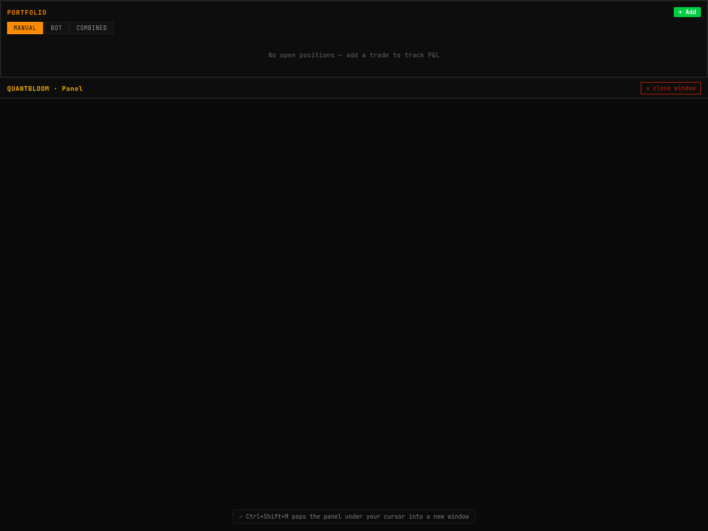
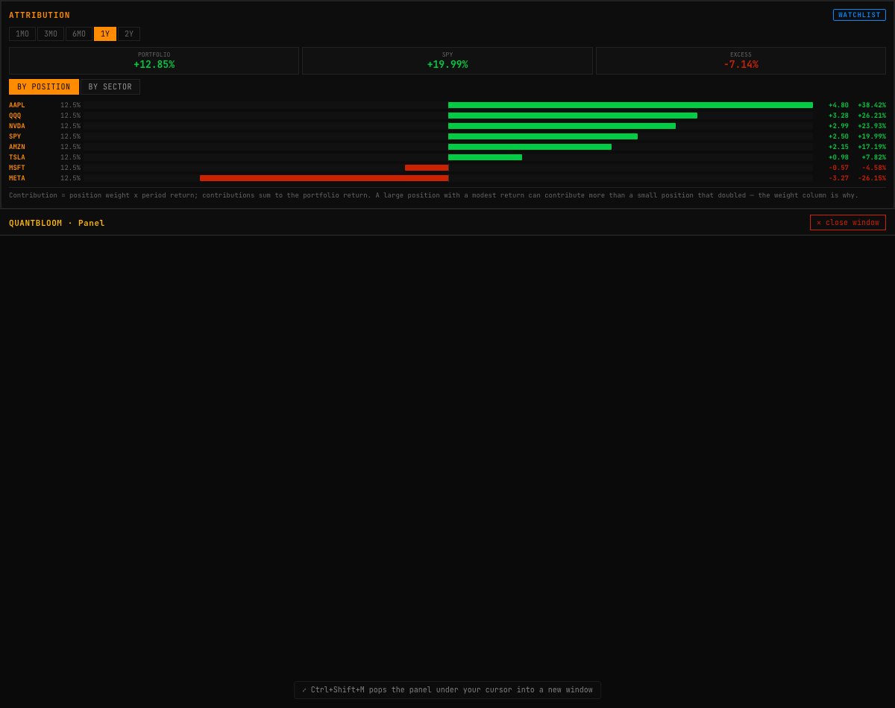
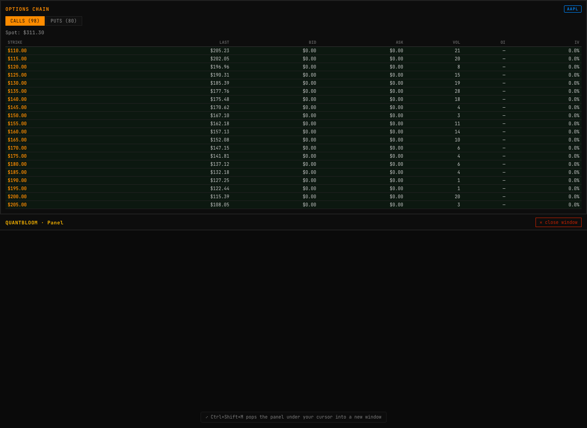
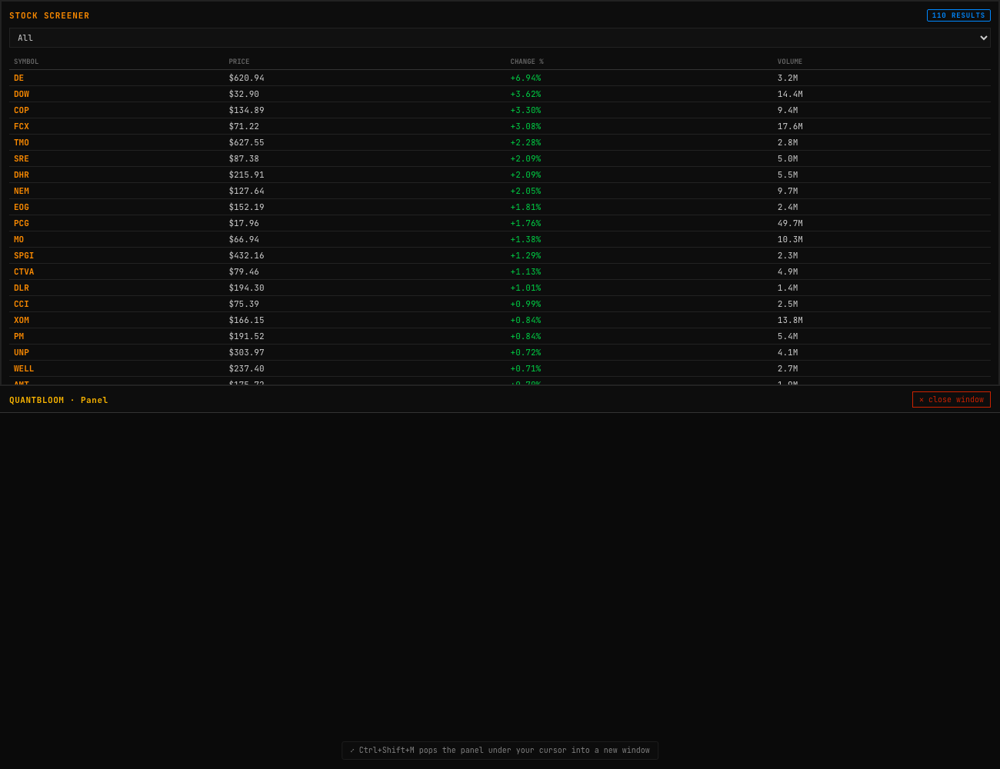
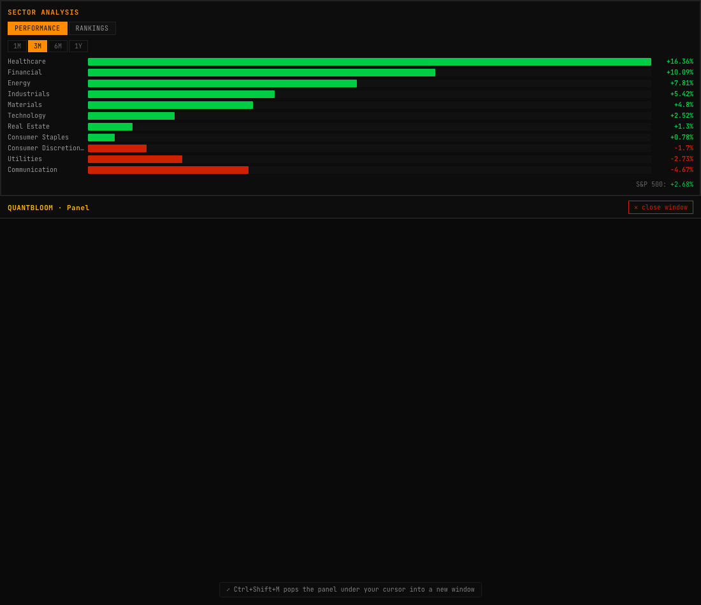
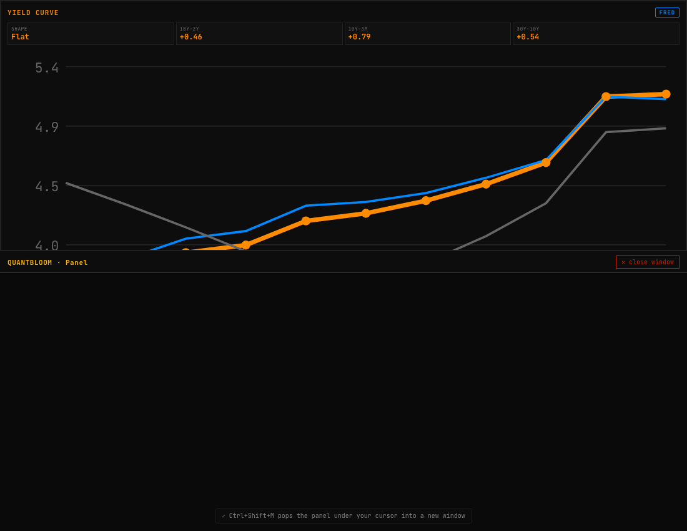
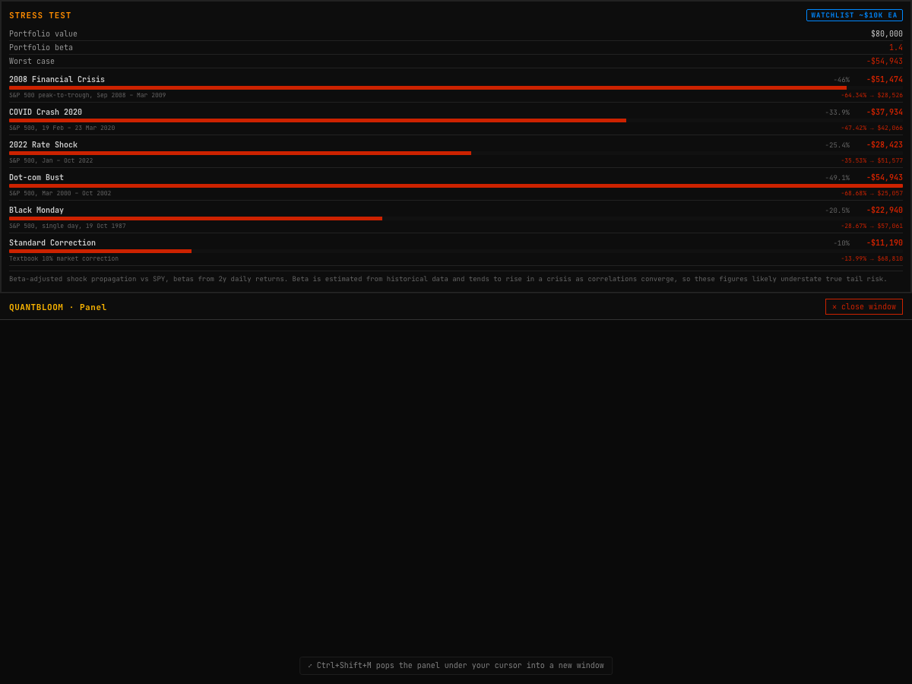
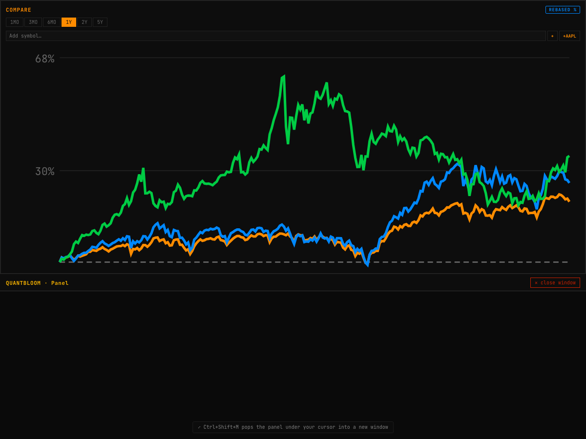

# QuantBloom Terminal — A Technical Whitepaper

### A browser-native quantitative trading terminal: charting, machine-learning signal research, backtesting with overfitting guards, an execution-gated paper-trading bot, portfolio analytics, and a power-markets desk

**Version 1.0**

---

## Abstract

QuantBloom Terminal is a single-page, browser-native quantitative research and
trading environment modelled on the workflow of a professional trading desk. It
unifies market data, advanced charting, a machine-learning signal pipeline, an
honest backtesting engine, a risk-gated paper-trading bot, a broad suite of
portfolio and derivatives analytics, and a power/commodities pricing desk into a
single 37-panel terminal. The system is written in JavaScript end to end — a
React/Vite front end and an Express API — with every numerically load-bearing
computation implemented as a pure, unit-tested module (332 tests at the time of
writing).

This paper documents the system in depth. Its emphasis is on the **mathematics**
of the trading and machine-learning components: the feature construction and
triple-barrier labelling; the three in-app model families (regularised logistic
regression, gradient-boosted decision trees, and a PCA latent-factor model built
on a from-scratch Jacobi eigensolver) and their ensemble; the metrics used to
judge them; and — most importantly — the **overfitting guards** (Probabilistic
and Deflated Sharpe ratios, and the Probability of Backtest Overfitting via
combinatorially-symmetric cross-validation) that form the publish gate. We also
document the point-in-time backtester, the rule-based strategies, the trading
bot's risk gate and bracket/trailing-stop machinery, the portfolio analytics
(mean-variance optimisation, three-method Value-at-Risk, factor regression, DCF,
and time-value-of-money), and the power-markets desk (merit-order dispatch,
locational marginal pricing under transmission congestion, spark spreads, and a
Monte-Carlo heat-rate call option) derived from a Citadel power & gas primer.

A recurring theme is **intellectual honesty**. The system is explicit about the
difference between *observed* and *modelled* quantities, and its most important
design decision — the publish gate — is built to reject models that do not
demonstrably beat a buy-and-hold benchmark out of sample. As documented in
Section 16, none of the daily-bar models currently clear that bar. We treat that
as the tooling working correctly, not as a failure to be tuned away.

---

## Table of Contents

1. Introduction and Motivation
2. System Architecture
3. Market-Data Layer
4. The Charting Engine
5. Feature Engineering and Labelling
6. Machine-Learning Models
7. Model Evaluation and the Publish Gate
8. Backtesting Methodology
9. Rule-Based Trading Strategies
10. The Trading Bot
11. The LLM Advisory Layer
12. Portfolio and Valuation Analytics
13. The Power & Commodities Desk
14. User Experience and Workflow
15. Testing and Validation
16. Honest Limitations
17. Conclusion and Future Work
    - Appendix A: Notation
    - Appendix B: Module and Test Index
    - References

---

## 1. Introduction and Motivation

Professional trading terminals — the Bloomberg Terminal being the archetype —
succeed because they collapse the distance between a question and its answer. A
trader types a ticker and a mnemonic and is instantly looking at the relevant
chart, fundamental, or analytic. QuantBloom pursues the same ergonomic goal in a
browser, but with a second, equally important commitment: **every number it
shows should be traceable to a tested computation, and every modelled quantity
should be labelled as such.**

The terminal is organised as a dashboard of independent panels. Each panel is a
self-contained React component that polls the API for the data it needs and
renders a focused view — a chart, a screener, a risk report, a pricing
calculator. A global command palette (`Ctrl+K`, the Bloomberg `TICKER <GO>`
pattern) sets the active symbol across the whole terminal or jumps to any panel;
any panel can be popped out into its own live browser window (`Ctrl+Shift+M`) to
spread work across monitors.

*Figure 1. The terminal hero — command bar, cross-asset ticker tape, and the
primary interactive chart.*

Beneath the UI sit three intellectual pillars, each of which this paper treats
in detail:

1. **Signal research** — a supervised-learning pipeline that turns OHLCV bars
   into point-in-time features, labels them with a triple-barrier scheme, trains
   several model families, and — crucially — refuses to "publish" a model that
   cannot beat buy-and-hold out of sample after correction for multiple testing.

2. **Execution** — a paper-trading bot whose every order passes a hard-coded
   risk gate, can carry broker-side stop-loss/take-profit brackets and a live
   trailing stop, and can be driven either by transparent rule strategies or by
   a selected ML model.

3. **Analytics** — a broad set of desk tools: mean-variance portfolio
   optimisation, three-method VaR, factor regression, discounted-cash-flow
   valuation, time-value-of-money, and a power-markets pricing desk.

### 1.1 Design principles

- **Tested maths, not trusted maths.** Anything that produces a number a user
  might act on lives in a pure module with a dedicated test file that asserts
  its *defining properties*, not merely that it runs.
- **Point-in-time everywhere.** Both the live signal path and the backtester
  compute features from bars `[0..t]` only; a model never sees a bar it could
  not have seen in production. Train/live feature parity is enforced.
- **Observed vs. modelled.** Panels that display a model (DCF, VaR, the power
  desk, any ML signal) say so in the interface. The system never presents a
  simulation as an observation.
- **Honest gating.** The publish gate is deliberately demanding. Most strategies
  fail it, which is the correct outcome for daily-bar technical analysis on
  liquid names.

---

## 2. System Architecture

### 2.1 Runtime shape

QuantBloom is two processes:

- A **React 18 + Vite** front end (`src/`) that renders the terminal and holds
  all UI state through the React Context API and `useReducer`.
- An **Express** API (`server.js`, ~2,900 lines) that proxies market data,
  computes the shared technical-indicator payload, and hosts the bot, backtest,
  and model-training routes (~50 routes in total).

For local or Docker deployment the Express server also serves the built
front-end, so `node server.js` is a single self-contained process. On a
serverless host (Vercel) the same `app` is exported as a function; the stateful
trading bot and file-based model persistence degrade gracefully to in-memory
there, and the UI documents that the bot needs a persistent process.

### 2.2 Module layout

The numerically important code is deliberately isolated from the UI and the
server so it can be tested in a plain Node process:

| Concern | Module(s) | Tested in |
|---|---|---|
| Options pricing & Greeks | `blackscholes.js` | `test/blackscholes.test.mjs` |
| OLS regression | `regression.js` | `test/regression.test.mjs` |
| Mean-variance optimisation | `portfolio-math.js` | `test/portfolio-math.test.mjs` |
| Feature engineering & labels | `bot/features.js` | `test/*` |
| Logistic / PCA / ensemble models | `bot/model.js` | `test/model.test.mjs`, `test/ensemble.test.mjs` |
| Gradient-boosted trees | `bot/gbm.js` | `test/gbm.test.mjs` |
| Eigendecomposition (Jacobi) | `bot/eigen.js` | `test/eigen.test.mjs` |
| PCA | `bot/pca.js` | `test/pca.test.mjs` |
| Overfitting statistics | `bot/statistics.js` | `test/statistics.test.mjs` |
| Backtester | `bot/backtest.js` | `test/backtest.test.mjs` |
| Risk gate | `bot/risk-gate.js` | `test/risk-gate.test.mjs` |
| Brackets / trailing stop | `bot/brackets.js` | `test/brackets.test.mjs` |
| Strategies | `bot/strategies.js` | `test/contrarian.test.mjs` |
| Chart-type transforms | `charting/chart-types.js` | `test/chart-types.test.mjs` |
| Indicator series | `charting/indicators.js` | `test/indicators-series.test.mjs` |
| Drawing maths | `charting/drawing-math.js` | `test/drawing-math.test.mjs` |
| Volume profile & structure | `charting/volume-profile.js` | `test/volume-profile.test.mjs` |
| Bar-replay state | `charting/replay.js` | `test/replay.test.mjs` |
| Formula interpreter | `charting/formula.js` | `test/formula.test.mjs` |
| Power markets | `charting/power.js` | `test/power.test.mjs` |
| Time value of money | `bot/tvm.js` | `test/tvm.test.mjs` |
| Command-palette logic | `src/lib/command.js` | `test/command.test.mjs` |

The rule is uniform: a panel is a thin rendering layer over a tested module.

---

## 3. Market-Data Layer

QuantBloom runs on free-tier and public data. Yahoo Finance (no key required)
provides OHLCV candles across timeframes and powers charts, quotes, screeners,
backtests, and the entire model lab. Optional keyed providers enrich specific
panels — Finnhub (fundamentals, analyst ratings, calendars), FRED (macro and the
yield curve), Alpha Vantage (quote fallback), Marketaux and NewsAPI (news with
sentiment). A missing key disables only the panel that needs it; the terminal
runs with none set.

The server maintains a small in-memory cache to smooth polling and shares one
canonical **technical-analysis payload builder** (`bot/indicators.js`,
`computeTechnical`) between the live `/api/v1/technical` route and the
backtester, so a rule strategy sees byte-identical indicator inputs whether it is
running live or being backtested. This is a deliberate anti-divergence measure:
the single most common source of "it worked in the backtest" errors is a
mismatch between research and production feature code.

---

## 4. The Charting Engine

The chart is built on `lightweight-charts` and extended with a family of tested,
clean-room implementations of standard chart constructions and indicators.

### 4.1 Chart types

Eight chart types are available. Several are native series styles; three are
deterministic transforms of the candle series implemented in
`charting/chart-types.js`:

**Heikin-Ashi.** A smoothing transform that averages the OHLC to damp noise:

$$
\begin{aligned}
\text{HA}_\text{close} &= \tfrac{1}{4}(O + H + L + C)\\
\text{HA}_\text{open}  &= \tfrac{1}{2}\big(\text{HA}_\text{open}^{\,t-1} + \text{HA}_\text{close}^{\,t-1}\big)\\
\text{HA}_\text{high}  &= \max(H,\ \text{HA}_\text{open},\ \text{HA}_\text{close})\\
\text{HA}_\text{low}   &= \min(L,\ \text{HA}_\text{open},\ \text{HA}_\text{close})
\end{aligned}
$$

with the seed $\text{HA}_\text{open}^{\,0} = \tfrac{1}{2}(O_0 + C_0)$. The
transform preserves the time axis one-to-one; the test suite asserts that the
close equals the OHLC mean, the open is the average of the previous HA open/close,
and the high/low bound both the HA body and the true range.

**Renko** rebuilds the series as fixed-size "bricks": a new brick of height equal
to the box size (defaulting to the average true range) is emitted only when price
moves a full box beyond the last brick's close, discarding sub-box noise. Because
Renko and Line-Break have no uniform time axis, bricks are emitted with strictly
increasing synthetic times so a candlestick renderer can display them.

**N-line break** (default $N=3$) draws a new line only when the close breaks
beyond the extreme of the last $N$ lines; smaller moves are absorbed, so a
reversal requires conviction.

### 4.2 Indicator series library

`charting/indicators.js` computes full **series** (not the point-in-time
snapshots the bot uses) for plotting. It provides SMA, EMA, WMA, anchored VWAP,
Bollinger, Keltner, Donchian, Parabolic SAR and SuperTrend as price overlays, and
RSI, MACD, Stochastic, CCI, Williams %R, ATR and OBV as sub-pane oscillators. A
registry carries each indicator's pane, colour, and parameters so the overlay
manager is data-driven. Representative definitions:

$$
\text{EMA}_t = \alpha\,P_t + (1-\alpha)\,\text{EMA}_{t-1},\quad \alpha = \frac{2}{n+1}
$$

$$
\text{RSI}_t = 100 - \frac{100}{1 + \text{RS}_t},\qquad
\text{RS}_t = \frac{\overline{\text{gain}}_n}{\overline{\text{loss}}_n}
$$

with Wilder's smoothing of the average gain and loss. The test suite asserts the
defining behaviours — RSI is 100 on a monotonic rise and ~0 on a decline and stays
in $[0,100]$; the MACD histogram equals MACD minus signal; Bollinger bands
straddle the middle band and widen with volatility; Donchian's upper/lower equal
the rolling max-high/min-low; OBV rises on up-closes and falls on down-closes.

### 4.3 Volume profile and market structure

`charting/volume-profile.js` buckets traded volume by **price** rather than time,
distributing each bar's volume across the price buckets its high-low range spans
weighted by overlap. It returns the **point of control** (the busiest price), and
a **value area** computed by expanding outward from the POC — at each step taking
whichever adjacent bucket holds more volume — until 70% of total volume is
enclosed. A companion `supportResistance` clusters swing pivots (bars that are the
strict extreme within a $\pm k$ window) into strength-ranked levels. The overlay
renders as a right-edge histogram with the POC and value area highlighted, plus
dashed support/resistance lines.

### 4.4 Drawing tools, replay, and multi-chart

The drawing layer stores anchors as `{time, price}` (so they stay pinned through
pan/zoom) and offers trend lines, horizontal lines, Fibonacci retracement and
extension, channels, ellipses, arrows, a **measure** tool (Δprice, Δ%, bars), and
a **long/short position** tool with a live reward-to-risk readout. The numeric
parts are factored into `charting/drawing-math.js` and tested — e.g.,
`positionRR(100, 110, 95)` returns a long trade with R:R 2.

**Bar replay** (`charting/replay.js`) reveals history one bar at a time from a
cursor so a setup can be reviewed exactly as it looked then; every layer — base
series, indicators, drawings, volume profile — slices to the same cursor, so
nothing leaks the future. The key test asserts `sliceUpTo` never returns a bar
whose time exceeds the cursor.

A **multi-chart** panel renders a 2- or 4-pane grid of fully independent charts,
each with its own symbol, timeframe, and data feed.

*Figure 2. The multi-chart grid — four independent, live charts.*

### 4.5 A neutral custom-indicator language

`charting/formula.js` is a small, sandboxed expression interpreter — a
tokeniser, a recursive-descent parser, and an AST evaluator over a fixed
whitelist of series (`open, high, low, close, volume, hl2, hlc3, ohlc4`),
functions (`sma, ema, stdev, rsi, abs, max, min`), and operators. It is
**not** `eval`: there is no grammar rule that can produce a JavaScript global,
prototype, or arbitrary call, so a user formula cannot reach outside itself. The
test suite includes an explicit sandbox battery — `constructor`, `window`,
`eval`, `__proto__` and member access are all rejected — alongside correctness
tests (SMA equals the hand-average, `close - sma(close,20)` is an oscillator).

*Figure 3. The sandboxed custom-indicator editor: a formula, live validation,
and a preview of the resulting series.*

---

## 5. Feature Engineering and Labelling

The ML pipeline begins by turning a candle series into a supervised dataset. This
is the most consequential and error-prone part of any trading-ML system, and the
one where point-in-time discipline matters most.

### 5.1 Point-in-time features

`bot/features.js` computes, at each bar $t$, a **19-dimensional** feature vector
from bars $[0..t]$ only. The features are chosen to be scale-free and to span
several economic ideas — momentum, mean-reversion, trend regime, range position,
and volatility regime:

- Returns: `ret1`, `ret5`, `roc20` (rate of change).
- Trend/location: `priceVsSma50`, `priceVsSma200`, `sma20Slope`.
- Oscillators: `rsi14`, `rsiSlope`, `macdHist`, `stoch`.
- Bands/range: `bollingerPct`, `distFrom120High`, `distFrom120Low`.
- Volume/vol: `volumeRatio`, `volatility`, `volRegime`, `atrPct`.

Every value passes through a finite-guard so no `NaN`/`Infinity` can reach a
model. The dataset builder uses a **200-bar warm-up** so that long-lookback
features (SMA-200) are fully formed from the first training row.

### 5.2 Cross-asset (market-relative) features

Optionally, five **market-relative** features are appended, computed against a
benchmark (SPY) whose closes are aligned to the stock's bar times with
carry-forward across gaps:

$$
\text{excessRet}_k = \frac{P_t}{P_{t-k}} - 1 - \left(\frac{B_t}{B_{t-k}} - 1\right),\quad k \in \{1,5\}
$$

plus a 20-bar relative-strength term and the 60-bar $\beta$ and correlation to the
benchmark:

$$
\beta_{60} = \frac{\operatorname{Cov}(r^{\text{stock}}, r^{\text{bench}})}{\operatorname{Var}(r^{\text{bench}})},\qquad
\rho_{60} = \frac{\operatorname{Cov}(r^{\text{stock}}, r^{\text{bench}})}{\sigma^{\text{stock}}\,\sigma^{\text{bench}}}.
$$

**Train/live parity is enforced by construction:** the model artifact records its
feature-name list; the live signal path detects a market-trained model by that
list's length and refuses to run without the benchmark rather than feed a
mis-shaped vector.

### 5.3 The triple-barrier label

Labels follow the triple-barrier method (López de Prado). For a long entered at
the close of bar $t$, three barriers are placed: an upper profit barrier at
$P_t(1+u)$, a lower stop barrier at $P_t(1-d)$, and a vertical time barrier at
$t+h$. Scanning forward,

$$
y_t = \begin{cases}
1 & \text{if the upper barrier is touched before the lower within } h \text{ bars}\\
0 & \text{if the lower barrier is touched first}\\
\mathbb{1}[P_{t+h} > P_t] & \text{if the time barrier is hit first}
\end{cases}
$$

with defaults $u=3\%$, $d=2\%$, $h=10$ bars. A conservative tie-break treats a bar
whose range straddles both barriers as a stop (the pessimistic assumption for a
long). Rows without enough future to determine the label are excluded — they
cannot be labelled and must not be invented.

### 5.4 Temporal splitting

Time series are **never** shuffled before splitting; the test set is always the
most recent contiguous slice (default 30%). Random $k$-fold splitting would leak
future information through serially-correlated adjacent rows, inflating every
metric. `temporalSplit` enforces this and is used everywhere a train/test split is
needed.

---

## 6. Machine-Learning Models

QuantBloom trains models entirely in-app (JavaScript), so research is
reproducible and requires no Python runtime. Four model *families* are available;
all share one prediction interface, `predictProba(model, featureRow) → [0,1]`,
which dispatches on `model.type`, so `evaluate()`, `modelStrategy()`, the
backtester, and the publish gate work with any family unchanged.

*Figure 4. The Model Lab — train a model, read its out-of-sample metrics, and see
the publish gate's decision.*

### 6.1 Regularised logistic regression

The baseline model predicts $P(y=1\mid x) = \sigma(w^\top z + b)$ where
$\sigma(a) = 1/(1+e^{-a})$ and $z$ is the standardised feature vector
$z_j = (x_j - \mu_j)/\sigma_j$ (the scaler is stored with the model). Training
minimises the L2-regularised cross-entropy

$$
\mathcal{L}(w,b) = -\frac{1}{N}\sum_{i=1}^{N}\Big[y_i\log p_i + (1-y_i)\log(1-p_i)\Big] + \frac{\lambda}{2}\lVert w\rVert^2
$$

by batch gradient descent, using the standard logistic gradient
$\nabla_w \mathcal{L} = \tfrac{1}{N}\sum_i (p_i - y_i)\,z_i + \lambda w$. It is a
transparent, low-variance baseline; any more complex model has to beat it.

### 6.2 Gradient-boosted decision trees

`bot/gbm.js` implements Friedman's gradient boosting as the in-app stand-in for
LightGBM/CatBoost. It fits an additive model $F_M(x) = \sum_{m=1}^{M}\nu\,h_m(x)$
of shallow regression trees to the **pseudo-residuals of the log-loss**. Working
in logit space with $p = \sigma(F)$, the negative gradient of the log-loss at
stage $m$ is simply

$$
r_i^{(m)} = y_i - \sigma\!\big(F_{m-1}(x_i)\big),
$$

i.e. the current probability error. Each stage fits a shallow CART regression tree
$h_m$ to $\{(x_i, r_i^{(m)})\}$ by exhaustive split search minimising squared
error, with a minimum-leaf-size constraint, and the ensemble is updated with a
learning rate $\nu$ (shrinkage). The final prediction is
$\sigma(F_M(x))$. Split-count **feature importance** is reported, normalised to
sum to one.

The decisive test is that the GBM **learns XOR** — a function no linear model can
represent — achieving accuracy $>0.85$ where logistic regression sits near
$0.5$. Building this model also surfaced a real methodological bug: a naive
linear-congruential PRNG produces serially-correlated "noise" that the GBM was
powerful enough to learn, giving fabricated out-of-sample AUC of 0.96; switching
to a `mulberry32` PRNG with independent feature/label streams restored the
expected $\approx 0.5$. This is itself a small demonstration of why the
overfitting guards in Section 7 exist.

### 6.3 The PCA latent-factor model

The latent-factor family (the in-app, clean-room stand-in for the ml4t-models
PCA/RPPCA/IPCA family) reduces the standardised features to their top-$k$
principal components — the directions of greatest variance, the "latent factors" —
then predicts the label from those components with logistic regression.

PCA requires the eigenvectors of the feature covariance matrix. Because a
covariance matrix is symmetric, QuantBloom uses a **from-scratch cyclic Jacobi
eigensolver** (`bot/eigen.js`). Jacobi repeatedly applies a plane rotation
$R(p,q,\theta)$ that annihilates the largest off-diagonal entry:

$$
\theta = \tfrac{1}{2}\operatorname{atan2}\!\big(2a_{pq},\ a_{pp}-a_{qq}\big),\qquad
A \leftarrow R^\top A R,
$$

accumulating $V \leftarrow VR$ until $A$ is diagonal; the diagonal then holds the
eigenvalues and the columns of $V$ the eigenvectors. The solver is verified
against known decompositions, orthonormality, $Av=\lambda v$ for every returned
pair, and the trace/determinant identities. PCA (`bot/pca.js`) standardises $X$,
forms the covariance from the columns, eigendecomposes it, and projects onto the
top-$k$ loadings; the fraction of variance explained per component is reported.
On real data, five factors typically capture $\approx 82\%$ of feature variance.

### 6.4 The ensemble

The ensemble averages the predicted probabilities of the GBM, logistic, and PCA
members:
$\hat p_\text{ens}(x) = \tfrac{1}{3}\big(\hat p_\text{gbm} + \hat p_\text{log} + \hat p_\text{pca}\big)$.
Averaging decorrelated errors trades a little of each model's bias for lower
variance; the test suite asserts the blend is never worse than its weakest
member. As Section 16 records, on real data the ensemble improves *robustness*
but does not beat the best single model, and — like every model here — does not
beat buy-and-hold.

### 6.5 Evaluation metrics

`evaluate()` reports accuracy, precision, recall, F1, and a rank-based **AUC**
computed via the Mann–Whitney statistic:

$$
\text{AUC} = \frac{1}{|\mathcal{P}||\mathcal{N}|}\sum_{i\in\mathcal{P}}\sum_{j\in\mathcal{N}}\mathbb{1}\big[\hat p_i > \hat p_j\big],
$$

which is threshold-independent and is not fooled by class imbalance the way raw
accuracy is. AUC is the primary discrimination metric in the publish gate.

---

## 7. Model Evaluation and the Publish Gate

The single most important design decision in QuantBloom is that a model cannot
reach the public page — or be trusted — merely because it looked good on a
backtest. Backtests are optimised over many trials, and the best of many random
strategies will look excellent by chance. The **publish gate**
(`bot/model-registry.js`, `evaluateGate`) enforces a battery of out-of-sample
tests, corrected for multiple testing, before a model is eligible.

### 7.1 Risk-adjusted return

`bot/statistics.js` computes the standard summary statistics on an equity curve.
For a return series $\{r_t\}$ with mean $\mu$ and standard deviation $\sigma$, the
annualised **Sharpe ratio** (with $N$ periods per year and risk-free rate $r_f$)
is

$$
\text{SR} = \frac{\mu - r_f/N}{\sigma}\sqrt{N},
$$

with the **Sortino ratio** replacing $\sigma$ by the downside deviation, and the
**maximum drawdown** the largest peak-to-trough decline of the cumulative curve.

### 7.2 The Probabilistic Sharpe Ratio

A Sharpe estimate from a finite, non-normal sample is itself uncertain. The
**Probabilistic Sharpe Ratio** (Bailey & López de Prado) gives the probability
that the true Sharpe exceeds a benchmark $\text{SR}^\star$, correcting for skew
$\gamma_3$ and kurtosis $\gamma_4$ and sample length $n$:

$$
\text{PSR}(\text{SR}^\star) = \Phi\!\left(
\frac{(\widehat{\text{SR}} - \text{SR}^\star)\sqrt{n-1}}
     {\sqrt{\,1 - \gamma_3\widehat{\text{SR}} + \tfrac{\gamma_4-1}{4}\widehat{\text{SR}}^{\,2}\,}}
\right),
$$

where $\Phi$ is the standard-normal CDF. Fat tails and negative skew *lower* the
PSR: the same point estimate is less trustworthy when returns are non-normal.

### 7.3 The Deflated Sharpe Ratio

When a researcher tries $M$ strategy variants and keeps the best, the maximum
observed Sharpe is inflated purely by selection. The **expected maximum Sharpe**
under the null (all variants have zero true edge) is approximated by

$$
\mathbb{E}[\max_M \widehat{\text{SR}}] \approx \sigma_{\text{SR}}\left[(1-\gamma)\,\Phi^{-1}\!\Big(1-\tfrac{1}{M}\Big) + \gamma\,\Phi^{-1}\!\Big(1-\tfrac{1}{Me}\Big)\right],
$$

with $\gamma$ the Euler–Mascheroni constant and $\sigma_{\text{SR}}$ the
cross-trial dispersion of Sharpe estimates. The **Deflated Sharpe Ratio** is then
the PSR benchmarked against *this* inflated threshold rather than zero:
$\text{DSR} = \text{PSR}(\mathbb{E}[\max_M \widehat{\text{SR}}])$. A strategy with
a high raw Sharpe but a DSR below ~0.90 is statistically indistinguishable from
the luckiest of the variants that were tried.

### 7.4 The Probability of Backtest Overfitting

`probabilityOfBacktestOverfitting` implements **combinatorially-symmetric
cross-validation** (CSCV). The performance matrix (strategies × time slices) is
split into all balanced combinations of in-sample and out-of-sample halves; for
each, the in-sample-best strategy's out-of-sample **rank** is recorded, mapped to
a logit $\lambda$, and the PBO is the fraction of combinations in which the
in-sample winner underperforms the out-of-sample median ($\lambda < 0$):

$$
\text{PBO} = \Pr[\lambda < 0].
$$

A PBO above 50% means selecting the best backtest is *worse* than a coin flip
out of sample — a direct, model-agnostic measure of overfitting.

### 7.5 The gate

A model is *eligible to publish* only if, on the held-out test window, it clears
**all** of:

| Criterion | Threshold | Guards against |
|---|---|---|
| Test AUC | $\ge 0.55$ | no directional edge |
| Out-of-sample Sharpe | $\ge 0.5$ | poor risk-adjusted return |
| Beats buy-and-hold | required | closet indexing |
| Deflated Sharpe | $\ge 0.90$ | multiple-testing luck |
| Test trades | $\ge 5$ | statistically empty backtest |
| Test rows | $\ge 60$ | too little held-out data |

The gate is deliberately demanding. The server re-checks eligibility on publish,
so a client cannot force a model through. Section 16 reports the honest
consequence: no daily-bar model currently clears it.

---

## 8. Backtesting Methodology

`bot/backtest.js` is an **event-driven, point-in-time** backtester shared in
spirit with the live engine. Its correctness rests on three rules:

1. **No look-ahead.** At each bar $t$, signals are computed from bars $[0..t]$
   only.
2. **Fills at the next bar's open.** A signal generated on the close of bar $t$
   fills at $O_{t+1}$, never at $C_t$. Filling at the signal bar's close is the
   classic way to fabricate returns; the backtester structurally forbids it.
3. **Costs on every fill.** Each fill pays commission (0.5¢/share), slippage
   (5 bps), and half-spread (2 bps). The reported cost drag is explicit.

Every run is compared to a **buy-and-hold** benchmark over the identical window.
`walkForward` runs rolling train/test folds and reports the fraction of folds in
which the strategy beats buy-and-hold and the consistency of that outperformance.
`sweepStrategies` tries many parameter variants and reports the Deflated Sharpe
and PBO **alongside** the raw numbers, so a user reads the honest picture rather
than the cherry-picked best.

*Figure 5. A single backtest run — strategy equity (orange) against buy-and-hold,
with a complete metrics table and the transaction-cost drag stated in dollars.*

When run on real SPY data, the tooling behaves exactly as it should: a rule
strategy returns +2.2% against buy-and-hold's +81.6% over the window, with a
Deflated Sharpe of 0 and a PBO of 65% — correctly reporting *no edge*.

---

## 9. Rule-Based Trading Strategies

`bot/strategies.js` provides six transparent strategies, each returning the same
shape `{action, confidence, rationale}` so they compose:

- **RSI reversion** — buy oversold ($\text{RSI}<30$), sell overbought ($>70$).
- **MACD momentum** — follow the histogram sign, scaled by size relative to price.
- **Trend following** — the 50/200 golden/death cross confirmed by price vs. the
  50-day.
- **Bollinger reversion** — fade moves outside the 20/2 bands.
- **Contrarian** — the default of the course trader bots: fade the latest move,
  $\text{position} = -\operatorname{sign}$ of recent momentum, using the 12-EMA as
  the momentum reference.
- **Indicator consensus** — the net vote across the twelve indicators in the
  technical engine.

An **ensemble** takes a weighted vote across the enabled strategies; disagreement
shrinks the confidence, and position size is confidence-proportional. Five
**presets** (conservative, balanced, aggressive, trend-only, reversion-only)
change how much the bot trades — pairing the two families that fail in opposite
regimes is what keeps the ensemble mostly still. Each strategy documents its
`worksWhen` and `failsWhen` in the UI.

---

## 10. The Trading Bot

The bot (`bot/engine.js`, `bot/alpaca.js`) trades a watchlist against an Alpaca
**paper** account. It is off by default and every order passes a hard risk gate.

*Figure 6. The trading bot — decision-engine selector, stop-loss/take-profit and
trailing controls, and the risk gate at work.*

### 10.1 The decision loop

Each cycle fetches account, positions and the market clock; checks halt
conditions; and for each watchlist symbol produces a decision either from the
rule ensemble or — if one is selected — from a trained ML model
(`modelStrategy`). The decision optionally passes through the LLM advisory layer,
then the risk gate, then execution.

### 10.2 The risk gate

`bot/risk-gate.js` is the safety core. Every order passes through `evaluateOrder`,
which **clamps rather than rejects** where it can, enforcing hard ceilings that
code — not configuration — guarantees:

- Max **5%** of equity per position; max **25%** per sector; max **100%** gross
  exposure.
- Max **2%** daily loss (auto-clears overnight) and max **10%** drawdown from the
  high-water mark (requires a manual restart).
- Max **20** orders/day; a liquidity cap of a fraction of 20-day ADV; a
  minimum order value to avoid dust.

`checkHaltConditions` distinguishes a daily-loss halt (temporary) from a
drawdown halt (which requires a deliberate restart), so a bad day cannot silently
resume into a bad week.

### 10.3 Position sizing

Size is confidence-proportional, bounded by the position ceiling:
$q = \big\lfloor \tfrac{E\cdot m\cdot \max(c,\,c_{\min})}{P} \big\rfloor$ where
$E$ is equity, $m$ the max-position fraction, $c$ the decision confidence, and $P$
the price.

### 10.4 Protective exits

`bot/brackets.js` computes tick-rounded stop-loss and take-profit prices for a
long entry ($\text{stop} < \text{entry} < \text{target}$) and submits them as an
Alpaca **bracket order**, so the exits are managed broker-side and fire even if
the bot process is down. Percentages are capped (stop $\le 50\%$, target
$\le 200\%$) so a fat-finger cannot disarm the protection. A **live trailing
stop** ratchets a per-symbol high-water mark each cycle and forces an exit when
price falls the trail distance below the peak; it runs *after* the LLM review so a
protective stop can never be vetoed.

### 10.5 The kill switch and self-training

The **kill switch** disables the bot, cancels working orders, flattens all
positions, and requires a manual restart. **Auto-train** trains a model on every
watchlist symbol and auto-selects the strongest — preferring one that clears the
publish gate, else the best out-of-sample AUC — and honestly reports "none worth
using" when nothing qualifies.

---

## 11. The LLM Advisory Layer

`bot/mistral.js` adds a Mistral LLM as a strictly **advisory** reviewer. It sees
a decision the quantitative layers already made and returns a structured
stance (`AGREE` / `DISAGREE` / `CAUTION`) with confidence and a stated key risk.
Its influence is one-directional — toward doing *less*: a confident `DISAGREE`
vetoes the trade (forces `HOLD`); a `CAUTION` or weak `DISAGREE` halves the
confidence (and thus the size). It can never originate a trade, flip a direction,
or increase size. Every call is logged with its full response, a daily budget cap
is enforced, and the layer degrades to a no-op when unavailable. This containment
is deliberate: the LLM's qualitative context (an earnings event, a news shock) is
valuable, but its failure modes — non-determinism, confident nonsense — are
neutralised by giving it no execution authority.

---

## 12. Portfolio and Valuation Analytics

### 12.1 Mean-variance optimisation

`portfolio-math.js` implements Markowitz optimisation in closed form via
**two-fund separation**. Given the covariance matrix $\Sigma$ and mean-return
vector $\mu$, with $\mathbf{1}$ the ones vector, define
$A = \mathbf{1}^\top\Sigma^{-1}\mathbf{1}$,
$B = \mathbf{1}^\top\Sigma^{-1}\mu$,
$C = \mu^\top\Sigma^{-1}\mu$. The **global minimum-variance** portfolio is

$$
w_{\text{mv}} = \frac{\Sigma^{-1}\mathbf{1}}{A},
$$

and every frontier portfolio is a combination of $w_{\text{mv}}$ and a second
efficient fund. The efficient frontier is traced by sweeping the risk-aversion
parameter $\lambda \ge 0$ (clamped non-negative so the lower, dominated branch of
the hyperbola is excluded — a bug the monotonicity test caught early). The
**tangency** (max-Sharpe) portfolio maximises $(w^\top\mu - r_f)/\sqrt{w^\top\Sigma w}$.

*Figure 7. Portfolio optimisation — the efficient frontier and the special
portfolios, labelled clearly as a historical-input model.*

### 12.2 Value at Risk

The VaR panel computes 95%/99% VaR and Conditional VaR (expected shortfall) by
**three methods** whose disagreement is itself informative:

- **Historical** — the empirical quantile of realised returns.
- **Parametric** — $\text{VaR}_\alpha = -(\mu + z_\alpha\sigma)\,V$ under
  normality, with $z_\alpha$ the standard-normal quantile.
- **Monte Carlo** — simulated draws from the fitted distribution.

Fat tails show up precisely as historical VaR exceeding parametric VaR; CVaR
(the mean loss beyond the VaR threshold) captures the tail the quantile omits.

*Figure 8. Three-method VaR — historical, parametric, and Monte-Carlo — with
Conditional VaR and volatility, modelled from the return history.*

### 12.3 Factor exposure

`regression.js` provides multiple OLS regression with $p$-values. The factor
panel regresses portfolio returns on Fama–French-style factor proxies (market,
size, value, momentum via representative ETFs),

$$
r_p = \alpha + \sum_k \beta_k f_k + \varepsilon,
$$

to reveal unintended style tilts; each loading is reported with its significance.

*Figure 9. Factor regression — the portfolio's style tilts and their
significance.*

### 12.4 DCF valuation and time value of money

The DCF panel discounts projected free cash flows with a Gordon-growth terminal
value and a WACC × terminal-growth sensitivity grid, producing an intrinsic value
against market price — labelled, emphatically, as a model only as good as its
inputs.

*Figure 10. DCF valuation — intrinsic value with a WACC × terminal-growth
sensitivity table.*

The **time-value-of-money** calculator (`bot/tvm.js`) implements present/future
value with compounding frequency $m$,
$\text{FV} = \text{PV}\,(1 + r/m)^{nm}$; net present value
$\text{NPV} = \sum_i \text{CF}_i/(1+r)^i$; internal rate of return by
Newton–Raphson with a bisection fallback; nominal/effective rate conversion; and
level annuities. Its tests use the source course's own worked answers as the
oracle — a \$1{,}000 payment discounted at 5% over 10 years is \$613.9133 annually
and \$607.1610 monthly.

---

## 13. The Power & Commodities Desk

A distinctive addition, derived from a Citadel power & gas primer (*"Power 2026:
Electricity Pricing in the Age of AI"*), is a wholesale-electricity pricing desk
(`charting/power.js`). Wholesale power clears by **marginal-cost (merit-order)
pricing**, which reduces to small, deterministic computations.

*Figure 11. The Power Desk — the merit-order supply stack; the dashed line is
demand, the marginal unit sets the clearing price.*

### 13.1 Merit-order dispatch and marginal pricing

Generators are ranked cheapest-first and dispatched to meet demand; the last unit
needed — the **marginal unit** — sets a single uniform clearing price that *every*
dispatched unit is paid. A cheaper unit therefore earns **inframarginal rent**
equal to (clearing price − its own cost) × MW, while the marginal unit earns zero.
The marginal cost of a thermal unit is
$\text{MC} = \text{HeatRate}\times \text{FuelPrice} + \text{VOM} + \text{Carbon}$,
so a change in the gas price re-orders the stack (fuel switching). The tests
assert cheapest-first dispatch, that pushing demand past a cheap unit raises the
price to the next unit, and that production cost sums own-cost (not the clearing
price).

### 13.2 Two-node locational marginal pricing

With a transmission line of finite capacity between two buses, the cheaper node
exports its spare capacity up to the line limit. While the line has slack, one
price clears both nodes; the moment it **saturates** and the dearer node must
self-supply, the prices **decouple** — the exporter clears at its low cost, the
importer at its high cost. That gap is the **congestion basis**, the payoff of a
Financial Transmission Right. The implementation reproduces the primer's example
exactly: 10 MW over a 50 MW line clears both nodes at \$10; 60 MW pins the line
and decouples to \$100 / \$10 (a \$90 basis); widening the line re-couples the
price.

*Figure 13. Transmission congestion — the line is pinned at its 50 MW limit, so
node A's price jumps to its local cost while node B stays cheap. The gap is the
congestion basis.*

### 13.3 Spark spreads and the heat-rate call option

The **spark spread** is a gas plant's gross margin,
$\text{spark} = \text{Power} - \text{HeatRate}\times\text{Gas}$ (the **dark
spread** is the coal analogue), and the **effective (break-even) heat rate**
$\text{HR}^\star = \text{Power}/\text{Gas}$ is the efficiency at which a unit
makes zero margin. A **heat-rate call option** monetises a plant's optionality —
it pays the positive spark day by day. QuantBloom values it by Monte Carlo on
correlated lognormal power and gas paths with martingale drift; by convexity the
option value is at least its intrinsic value, rises with volatility, and falls as
power and gas co-move (a tighter spread). All four properties are asserted in the
test suite.

### 13.4 The duck curve and scarcity pricing

Net demand (demand minus renewables) develops a midday trough and an evening
spike as solar penetration grows — the **duck curve** — which forces less
efficient units on in the evening and steepens the intraday price shape.
Energy-only markets add a **scarcity adder** of VOLL × P(lost load) on top of the
marginal energy price when supply runs short. Both are provided as interactive,
clearly-labelled stylised models — QuantBloom has no live ISO/LMP feed, and says
so.

*Figure 14. The duck curve — as solar (green) grows, net demand (blue) develops a
midday belly and an evening neck, steepening the intraday price shape.*

---

## 14. User Experience and Workflow

Two Bloomberg-signature interactions make the 37-panel terminal navigable:

- **Command palette (`Ctrl+K`).** The `TICKER <GO>` pattern: one box in which a
  ticker sets the active symbol across every panel, or a panel name jumps to it
  with a highlight flash. The parsing and ranking (`src/lib/command.js`) are pure
  and tested — a short alpha token is treated as a ticker; an exact panel-title
  match outranks the symbol command.
- **Panel pop-out (`Ctrl+Shift+M`).** Any panel opens in its own live browser
  window — the terminal navigates to `?solo=<index>`, and a fresh app instance
  focuses that one panel full-window — so panels can be spread across monitors,
  each fully interactive with its own data. (Every figure in this paper was
  captured through exactly this mechanism.)

Authentication is optional and Bloomberg-style: with Supabase configured, access
is gated behind a login screen and each signed-in user is mirrored to a Neon
Postgres table; with it unconfigured, the terminal runs open. A Help & Shortcuts
panel documents the interactions on-platform.

*Figure 12. The technical-analysis panel — twelve indicators, each scored, rolled
into an overall signal.*

---

## 15. Testing and Validation

At the time of writing the repository carries **332 passing unit tests** run by
the Node built-in test runner (`node --test`). The philosophy is to assert
*defining properties* rather than fixtures: the GBM must crack XOR; `sliceUpTo`
must never leak a future bar; the eigensolver must satisfy $Av=\lambda v$; the
formula sandbox must reject `constructor`/`window`/`eval`; the two-node model must
reproduce the primer's \$100/\$10 decoupling; the TVM functions must match the
source's worked answers to the cent; the merit-order price must jump to the next
unit when a cheap unit saturates. Where a computation is deterministic, the test
pins the exact number; where it is stochastic, a fixed seed makes it
reproducible. Numerically load-bearing changes are verified in the browser (the
production bundle, served by `node server.js`) before they are committed.

---

## 16. Honest Limitations

QuantBloom is built to tell the truth, and the most important truth is about its
own models:

- **The models do not beat buy-and-hold.** The best daily-bar model reaches a
  test AUC of roughly 0.59 — genuine but small discrimination — and none clears
  the publish gate. Long-only market-timing of a bull market with a strategy that
  is often in cash cannot beat simply holding the index. The ensemble improves
  robustness, not edge; cross-asset (SPY-relative) features help a high-beta name
  like NVDA (AUC $0.52 \to 0.56$) but are noise for others. This is the honest
  reality of daily-bar technical analysis on liquid names, and the publish gate
  is designed to report it rather than hide it. **We did not weaken the gate to
  manufacture a pass.**
- **No live LMP or Level-2 feed.** The power desk, VaR, DCF, and TVM panels are
  *calculators and stylised models*, not live grid or order-book data. They are
  labelled as such throughout.
- **Daily bars.** The signal pipeline runs on daily OHLCV. The most credible path
  to genuine edge — per the source materials — is finer granularity (intraday
  bars), alternative data, or a different objective (confidence-weighted sizing
  rather than binary direction), not more model families on the same 19 features.
- **Paper trading only.** The bot targets an Alpaca paper endpoint by default;
  `isPaperEndpoint()` asserts it. Nothing here is investment advice.

---

## 17. Conclusion and Future Work

QuantBloom Terminal demonstrates that a rigorous, honest quantitative research and
trading environment can be built entirely in the browser, with every
load-bearing number backed by a tested module. Its contributions are less any
single model than the *discipline* around them: point-in-time features with
enforced train/live parity, a backtester that structurally forbids look-ahead, and
a publish gate that corrects for multiple testing and refuses to endorse a model
that cannot beat buy-and-hold out of sample.

Natural next steps follow directly from Section 16 and the roadmap: intraday-bar
research; a cross-asset monitor board and an options volatility surface to round
out Bloomberg parity; a live ISO/LMP integration to turn the power desk's
calculators into a live desk; and the local Python pipeline (documented in
`MODEL_TRAINING.md`) for the heavier model families (LSTM/CAE/SDF) that cannot run
in the Node runtime, imported back through the same artifact contract and the same
unforgiving publish gate.

---

### Appendix A — Notation

| Symbol | Meaning |
|---|---|
| $P_t, O_t, H_t, L_t, C_t$ | price / open / high / low / close at bar $t$ |
| $r_t$ | period return |
| $\sigma(\cdot)$ | logistic sigmoid |
| $z$ | standardised feature vector |
| $\Sigma, \mu$ | covariance matrix, mean-return vector |
| $\text{SR}, \text{PSR}, \text{DSR}$ | Sharpe, Probabilistic, Deflated Sharpe |
| $\text{PBO}$ | Probability of Backtest Overfitting |
| $\text{LMP}$ | locational marginal price |
| $u, d, h$ | triple-barrier up / down / horizon |

### Appendix B — Module and Test Index

See the table in Section 2.2. Every listed module has a dedicated test file; the
full suite is run with `npm test` (`node --test "test/*.test.mjs"`).

### Appendix C — A Worked Example: NVDA Through the Pipeline

To make the abstractions concrete, this appendix traces a single symbol through
the full research pipeline with the actual numbers the system produces.

**Step 1 — Data.** Five years of daily NVDA candles are pulled from Yahoo (no
key). With a 200-bar warm-up and a 10-bar label horizon, roughly 1,000 labelled
rows survive.

**Step 2 — Features.** Each surviving bar becomes a 19-dimensional point-in-time
vector (Section 5.1). Enabling the cross-asset option (Section 5.2) aligns SPY to
NVDA's bar times and appends five market-relative features, widening the vector
to 24 and flagging the model `usesMarket` so the live path knows to supply the
benchmark.

**Step 3 — Labelling.** Each row is labelled by the triple barrier (Section 5.3):
$+3\%$ up, $-2\%$ down, 10-bar horizon. The dataset is split temporally, the most
recent 30% held out and never shuffled.

**Step 4 — Training.** A gradient-boosted model (80 trees, depth 3, learning rate
0.08, minimum leaf 15) is fit on the training split. It reports split-count
feature importance; on NVDA the top drivers are typically volume ratio, MACD
histogram, and short-horizon return.

**Step 5 — Metrics.** On the held-out window, the model reaches a **test AUC of
about 0.59** with the base features. Adding the cross-asset features lifts a
high-beta name like NVDA to **~0.56–0.62** depending on the window — genuine but
modest discrimination. The logistic baseline sits near 0.50; PCA near 0.44–0.52;
the ensemble lands between its members.

**Step 6 — Out-of-sample backtest.** The model is turned into a strategy
(`modelStrategy`) and backtested over the test window with point-in-time signals,
next-bar-open fills, and full costs. The strategy is compared to buy-and-hold; its
Deflated Sharpe and trade count are computed.

**Step 7 — The gate.** The publish gate (Section 7.5) checks AUC $\ge 0.55$, OOS
Sharpe $\ge 0.5$, beat buy-and-hold, Deflated Sharpe $\ge 0.90$, $\ge 5$ trades,
$\ge 60$ rows. On daily NVDA the model **fails** — it does not beat buy-and-hold
over a bull run in which it is often in cash — and auto-train reports it, honestly,
as "not worth using." A researcher may still *select* the model for paper testing;
it simply cannot be *published*.

This is the pipeline working as designed: it produced a model with real (if small)
discrimination, measured it without look-ahead, corrected for multiple testing,
and declined to endorse it. Manufacturing a "pass" would require weakening the
gate — which the system deliberately does not do.

### Appendix D — Panel Gallery

The terminal's 37 panels span data, analytics, execution, and pricing. A
selection, each captured through the pop-out mechanism:

*Figure 15. Portfolio — positions with live P&L, weights, and source tagging
(manual vs. bot).*

*Figure 16. Performance attribution — return contribution by position and sector
against the benchmark.*

*Figure 17. The options chain with Black-Scholes Greeks (delta, gamma, theta,
vega) and numerically-solved implied volatility.*

*Figure 18. The stock screener — filtering the universe on fundamental and
technical criteria.*

*Figure 19. Sector analysis — a heat-tiled view of relative sector performance.*

*Figure 20. The Treasury yield curve from FRED, with key spreads.*

*Figure 21. Stress testing — replaying historical crises and custom shocks
against the current book via beta-adjusted propagation.*

*Figure 22. Rebased cross-asset comparison — several instruments normalised to a
common base for relative-performance analysis.*

### References

1. M. López de Prado, *Advances in Financial Machine Learning*, Wiley, 2018
   (triple-barrier labelling; the Deflated Sharpe Ratio; CSCV / PBO).
2. D. Bailey and M. López de Prado, "The Deflated Sharpe Ratio: Correcting for
   Selection Bias, Backtest Overfitting, and Non-Normality," *Journal of Portfolio
   Management*, 2014.
3. J. H. Friedman, "Greedy Function Approximation: A Gradient Boosting Machine,"
   *Annals of Statistics*, 2001.
4. H. Markowitz, "Portfolio Selection," *Journal of Finance*, 1952.
5. N. Somani, *Power 2026: Electricity Pricing in the Age of AI* (merit-order
   pricing, LMP and transmission congestion, spark spreads, heat-rate call
   options, the duck curve, scarcity pricing).
6. F. Black and M. Scholes, "The Pricing of Options and Corporate Liabilities,"
   *Journal of Political Economy*, 1973.

---

*QuantBloom Terminal is a research and education platform. Nothing in this
document is investment advice, and no metric is a prediction. The trading bot
targets a paper account by default; backtested performance does not predict
future returns.*
